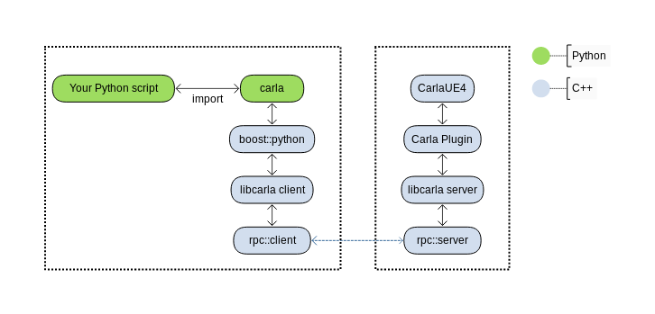

Build system for the new architecture of CARLA
==============================================

[](https://travis-ci.org/nsubiron/libcarla)

Demo project for developing the new build system and architecture of
[CARLA Simulator](http://carla.org).

This new architecture supports multi-client multi-agent communication, basically
any number of Python clients can connect and send instructions to the simulator
simultaneously. The result is a new API that allows a finer control of each
actor in the scene

```py
import carla

client = carla.Client('localhost', 8080)

transform = carla.Transform(
    carla.Location(x=5.0, y=4.0),
    carla.Rotation(yaw=180))

vehicle = client.spawn_vehicle(transform)

vehicle.apply_control(carla.VehicleControl(throttle=1.0))
```

## Design

The most challenging part of the setup is to compile all the dependencies and
modules to be compatible with a) Unreal Engine in the server-side, and b) Python
in the client-side.

The goal is to be able to call Unreal Engine's functions from a separate Python
process.



## Compilation

Required compiler

  * clang++-5.0

Best if it is set up as default version of clang

    $ sudo update-alternatives --install /usr/bin/clang++ clang++ /usr/lib/llvm-5.0/bin/clang++ 101
    $ sudo update-alternatives --install /usr/bin/clang clang /usr/lib/llvm-5.0/bin/clang 101

Everything is compiled with `-std=c++17`.

#### Dependencies

Command

    $ make setup

Get and compile dependencies

  * llvm-5.0 (libc++ and libc++abi)
  * rpclib-2.2.1 (both with libstdc++ and libc++)
  * boost-1.67 (headers only)
  * googletest-1.8.0 (with libc++)

#### CarlaLib

Compiled with CMake (min. version required CMake 3.9).

Command

    $ make build

Two configurations:

|                 | Server       | Client    |
|-----------------|--------------|-----------|
| **Unit tests**  | yes          | no        |
| **Requires**    | rpclib, gtest, boost | rpclib, boost
| **std runtime** | LLVM's `libc++` | Default `libstdc++` |
| **Output**      | headers and test exes | `libcarla_client.a` |
| **Required by** | Carla plugin | PythonAPI |

#### CarlaUE4 and Carla plugin

Both compiled at the same step with Unreal Engine 4.19 build tool. First of all,
it requires to install Unreal Engine with the usual

    $ git clone --depth=1 -b 4.19 https://github.com/EpicGames/UnrealEngine.git ~/UnrealEngine_4.19
    $ cd ~/UnrealEngine_4.19
    $ ./Setup.sh && ./GenerateProjectFiles.sh && make

Don't forget to set your `UE4_ROOT` environment variable

    $ export UE4_ROOT=~/UnrealEngine_4.19

Then build and launch CarlaUE4 project with

    $ make CarlaUE4Editor launch

UE4Editor should open after compilation.

#### PythonAPI

Compiled using Python's `setuptools` ("setup.py"). Currently requires the
following to be installed in the machine: Python, libpython-dev, and
libboost-python-dev; both for Python 2.7 and 3.5.

Command

    $ make dist

It creates two "egg" packages

  * PythonAPI/dist/carla-0.9.0-py2.7-linux-x86_64.egg
  * PythonAPI/dist/carla-0.9.0-py3.5-linux-x86_64.egg

This package can be directly imported into a Python script by adding it to the
system path

```py
#!/usr/bin/env python

import sys

sys.path.append(
    'dist/carla-0.9.0-py%d.%d-linux-x86_64.egg' % (sys.version_info.major,
                                                   sys.version_info.minor))

import carla
```
